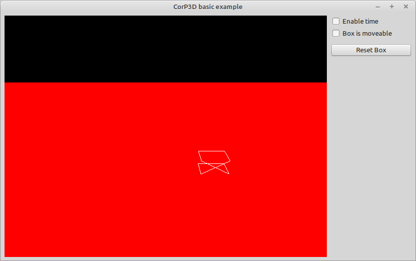

This is the most Basic Example that someone can think of.

>
> ! Attention ! this is a work in progress, not fully working yet.
>

## Content
- Initialize the CorP3D Engine
'''- Create a floor plane
- Create some elements
- Simulate time and see results
- Change State of Object (solid / movable) and reset if needed
- Detect collisions

## Additional list of needed sources
- none
